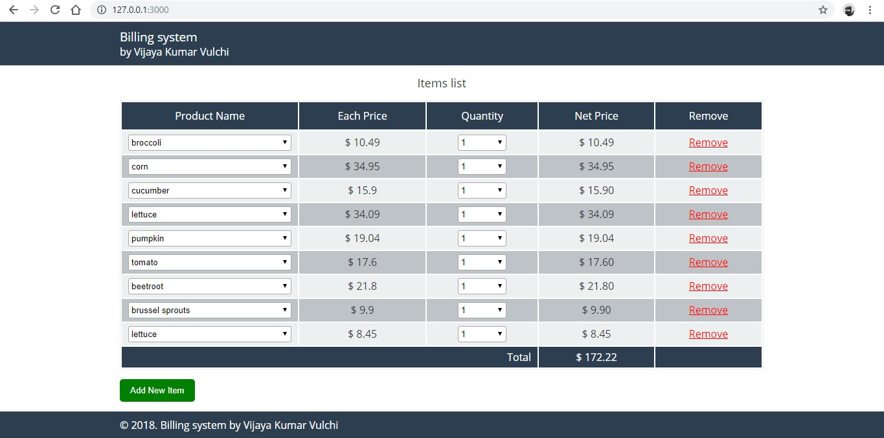

# Knockoutjs-Billing-System-App-Sample
Learning knockout.js application building - Billing system app

# for local setup
1. install node env
2. go to root directory
3. run npm start
4. paste in browser http://127.0.0.1:3000/

# screenshots

# <a href="https://codepen.io/vulchivijay/full/KGNqmz/" target="_blank">demo available in codepen</a>
